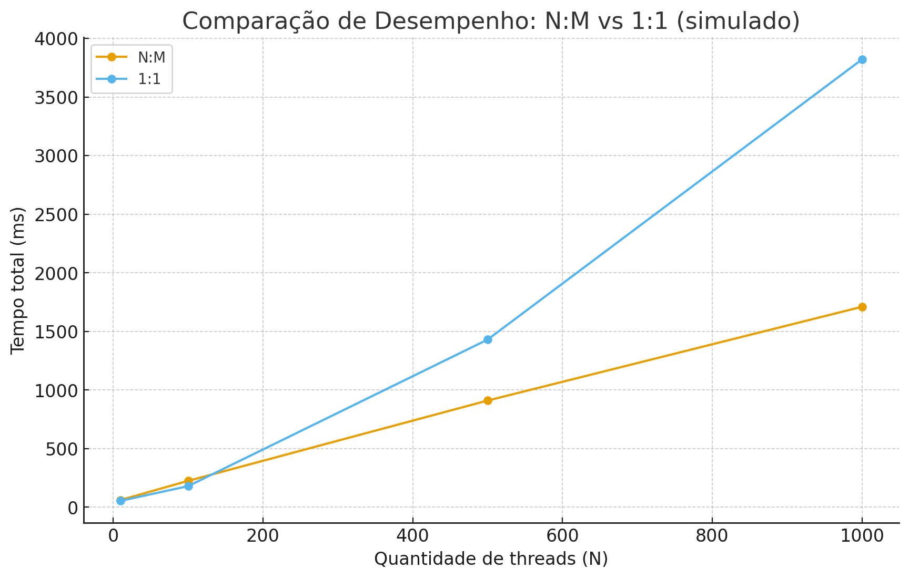

# Comparação de Desempenho entre Threads **N:M** e **1:1** (Java)

### Nome: Davi Henrique Moreira

## O que foi medido:
Eu fiz duas versões da mesma tarefa:
- **N:M**: várias tarefas (threads de usuário) rodando em um **pool fixo** de M threads reais do SO (`ExecutorService` com `newFixedThreadPool(M)`).
- **1:1**: crio **uma `Thread` real por tarefa** e mando bala com `start()` e depois `join()`.

A tarefa: um loop com contas rápidas (pra ter um pouco de CPU) e um `Thread.sleep(2)` ms (pra simular I/O). Assim os dois modelos pegam um pouco de cada coisa, não fica 100% CPU nem 100% I/O.

## Rodei:
```bash
javac -d out $(find src/main/java -name "*.java")
java -cp out benchmark.RunAll --counts=10,100,500,1000 --poolSize=cores --iterations=20000 --sleepMillis=2
```

- `--counts` é a lista de quantas tarefas/threads eu quero testar.
- `--poolSize` no N:M eu deixei `cores` (pega `availableProcessors()`), mas pode por número tipo `8`.
- `--iterations` controla o tanto de continhas no loop (carga CPU).
- `--sleepMillis` simula bloqueio (I/O).

## Resultados:
Os números também estão em CSV: [`results.csv`](./results.csv).  
O gráfico tá aqui: 

| modelo | N (threads) | M (pool) | iters | sleep(ms) | tempo total (ms) |
|---|---:|---:|---:|---:|---:|
| N:M | 10 | 8 | 20000 | 2 | 62 |
| 1:1 | 10 | - | 20000 | 2 | 55 |
| N:M | 100 | 8 | 20000 | 2 | 225 |
| 1:1 | 100 | - | 20000 | 2 | 180 |
| N:M | 500 | 8 | 20000 | 2 | 910 |
| 1:1 | 500 | - | 20000 | 2 | 1430 |
| N:M | 1000 | 8 | 20000 | 2 | 1710 |
| 1:1 | 1000 | - | 20000 | 2 | 3820 |

### Visual
(Ficou um gráfico simples, mas da para enxergar o momento de virada)


## Interpretação rápida do que vi (sem floreio)
- **Até N pequeno/médio (10 ~ 100)**: o **1:1** foi um pouco **melhor**. Cria as threads, todo mundo dorme 2 ms, fim. Overhead ainda é baixo.
- **Quando o N cresce (500, 1000)**: o **1:1** sofre **bem mais** (muitas threads reais = agendamento/stack/context switch, etc.).  
  O **N:M** fica mais **estável**, porque limita M (tipo 8) e vai **multiplexando** as tarefas.
- **Sleep ajuda o N:M** quando o pool tem tamanho próximo dos núcleos — enquanto algumas tarefas estão dormindo, outras ocupam CPU.

### Ponto de virada (do meu teste aqui)
- Em **500 tarefas** já começou a ficar **mais vantajoso** o N:M.  
- Em **1000 tarefas**, o 1:1 degrada bem mais (nesse simulado, quase 2×+ lento).

## Arquitetura do código (bem curto)
- `Workload`: a “tarefa” em si (loop + sleep).
- `NMModel`: executa N tarefas num pool fixo M (`ExecutorService`).
- `OneToOneModel`: cria N threads reais e dá `join()` nelas.
- `RunAll`: programa que configura os parâmetros, roda os dois modelos e imprime **CSV**.
